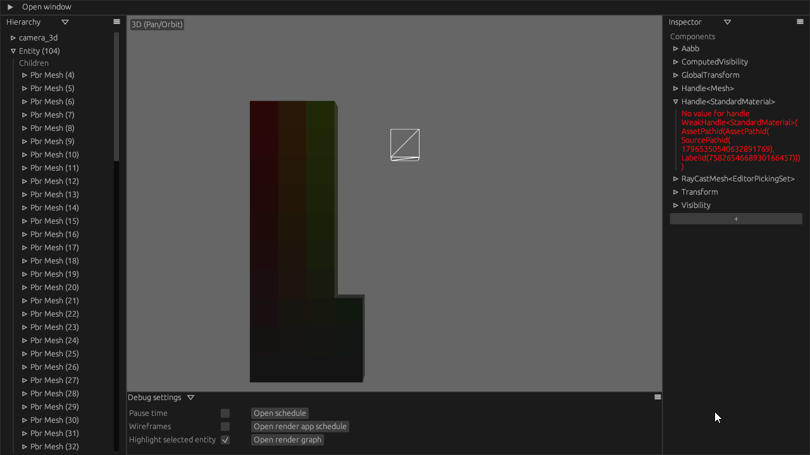

# LoadContext bug

It seems Bevy's `LoadContext` sometimes drops handles to asset resources, causing assets to silently have missing parts.

### Expected:

### Actual (this happens 75% of the time)

### Inspector

The meshes are still there, but the material handle is invalid

